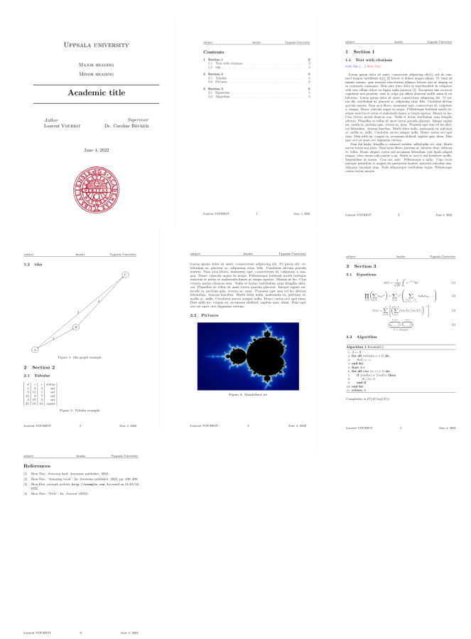

# tex-templates
## My Latex templates

### How to use the make file

to build : 
```
$ make FILE=report 
```

to clean the build directory : 

```
$ make clean
```
-----------------------------

### Big Report




